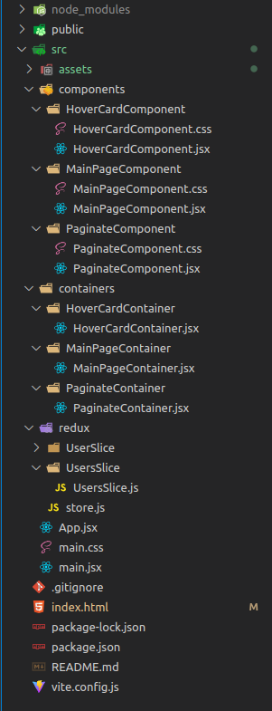
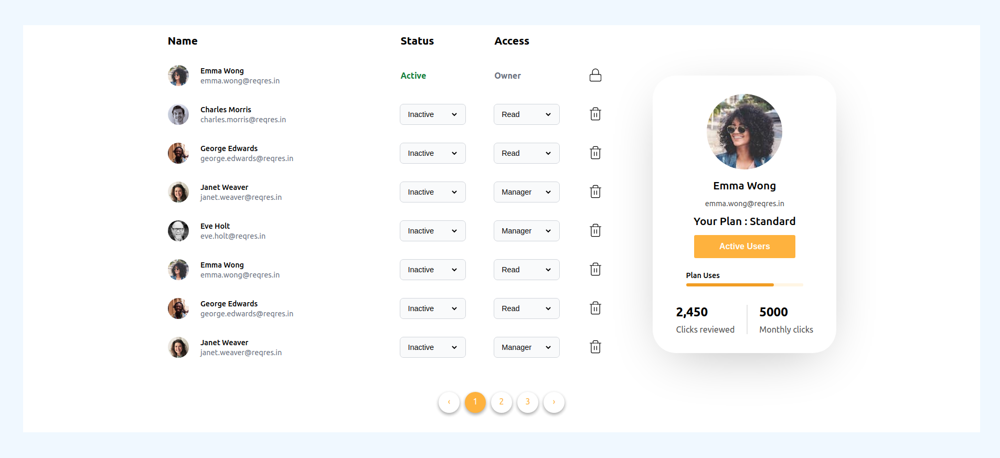

# React-Practical-5

## Deployement Link

```jsx
https://ireact-practical-5.netlify.app/
```

## **Getting Started**

To get started with the project, follow the instructions below.

## **Introduction**

This project is a simple React application that displays a list of users and their details. When a user hovers over a particular user's name, a card with that user's details is displayed.

## **Installation**

To install this application, follow these steps:

1. Clone this repository to your local machine using the command **`git clone https://github.com/zilenmodi/React-Practical-5`**
2. Navigate to the project directory using the command **`cd user-list-react-app`**
3. Install the project dependencies using the command **`npm install`**
4. Start the development server using the command **`npm run dev`**

## **Project Structure**

The project structure is organized into **`src`** folder.

- **`src/components`**: contains the reusable UI components.
- **`src/containers`**: contains the components that manage the application state and use the UI components.
- **`src/redux`**: contains the Redux store, reducers, and actions.



## **Features**

- Displays a paginated list of users fetched from the API
- Hovering over a user displays their user card
- Uses Redux Toolkit and Thunk for state management and API calls

## **Using the Application**

Once you have the application running, you can view it in your browser at **`http://localhost:5173/`**.

The application displays a list of users on the left-hand side of the screen. When you hover over a particular user, a user card will appear on the right-hand side of the screen with more detailed information about that user.

## Snapshot:



## **Technologies**

This project was built with the following technologies:

- React.js
- Redux
- HTML
- CSS

## **License**

This project is licensed under the MIT License. See the **[LICENSE](https://chat.openai.com/LICENSE)** file for details.
